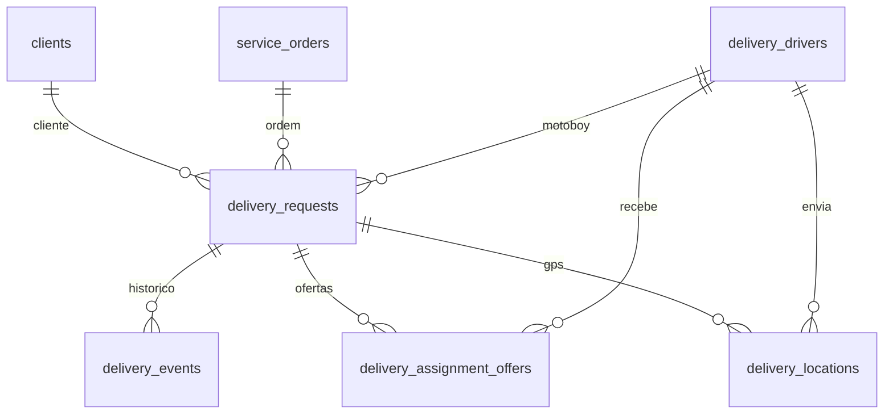

# Modulo Coleta e Entrega - Schema de banco

Este documento descreve as tabelas do modulo administrativo de Coleta e Entrega, incluindo distribuicao automatica e rastreamento por GPS.

## Tabelas

### delivery_drivers

Cadastro dos motoboys.

Campos principais:
- `id`: chave primaria.
- `name`: nome do motoboy.
- `phone`, `document`, `vehicle`, `plate`: dados operacionais.
- `status`: Disponível, Em rota, Coletando, Em transporte, Entregue ou Offline.
- `latitude`, `longitude`: ultima posicao conhecida.
- `notes`, `created_at`: observacoes e data de cadastro.

### delivery_settings

Configuracao de frete por km.

Campos principais:
- `price_per_km`: valor por km.
- `minimum_fee`: taxa minima.
- `free_radius_km`: raio sem cobranca.
- `notes`: observacoes.

### delivery_requests

Solicitacoes de coleta/devolucao vinculadas a cliente e, quando houver, a uma OS.

Campos principais:
- `order_id`: vinculo com `service_orders.id`.
- `client_id`: vinculo com `clients.id`.
- `driver_id`: motoboy atribuido.
- `type`: Coleta ou Devolucao.
- `status`: Solicitada, Aguardando aceite, Em rota, Coletando, Em transporte, Entregue ou Cancelada.
- `pickup_latitude`, `pickup_longitude`: ponto da coleta.
- `distance_km`, `freight_value`: distancia e valor do frete.
- `assignment_status`, `assignment_started_at`: controle da distribuicao automatica.
- `collected_at`, `delivered_at`: horarios reais de coleta e entrega.
- `document_status`, `document_notes`, `proof_url`, `notes`: documentos, comprovantes e observacoes.

### delivery_assignment_offers

Fila de ofertas automaticas para motoboys.

Campos principais:
- `delivery_id`: entrega relacionada.
- `driver_id`: motoboy que recebeu a oferta.
- `status`: Oferecida, Aceita, Recusada ou Expirada.
- `distance_km`: distancia calculada para ordenar a oferta.
- `offered_at`, `expires_at`, `responded_at`: controle dos 60 segundos de resposta.
- `note`: observacao da oferta.

### delivery_locations

Historico de rastreamento GPS.

Campos principais:
- `delivery_id`: entrega relacionada.
- `driver_id`: motoboy que enviou/teve a posicao registrada.
- `latitude`, `longitude`: posicao.
- `accuracy_m`: precisao informada pelo navegador/dispositivo.
- `status`: status da entrega no momento do registro.
- `source`: origem do ponto, por exemplo painel ou motoboy.
- `recorded_at`: horario do registro.

### delivery_events

Historico operacional da entrega.

Campos principais:
- `delivery_id`: entrega relacionada.
- `user_id`: usuario que realizou a acao, quando houver.
- `old_status`, `new_status`: mudanca de status.
- `note`, `created_at`: observacao e horario.

## Relacionamentos

